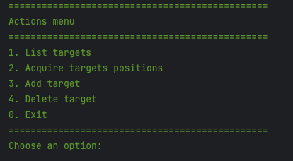
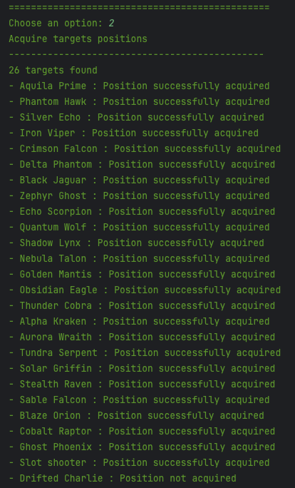
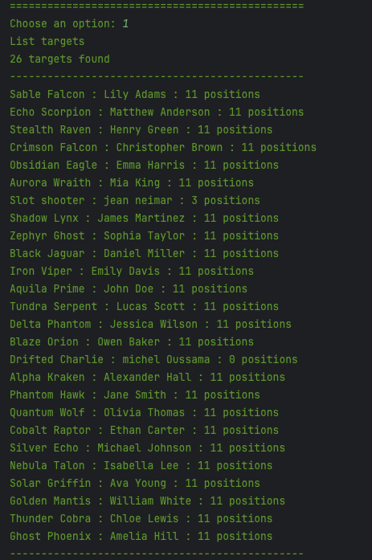
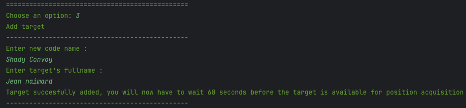
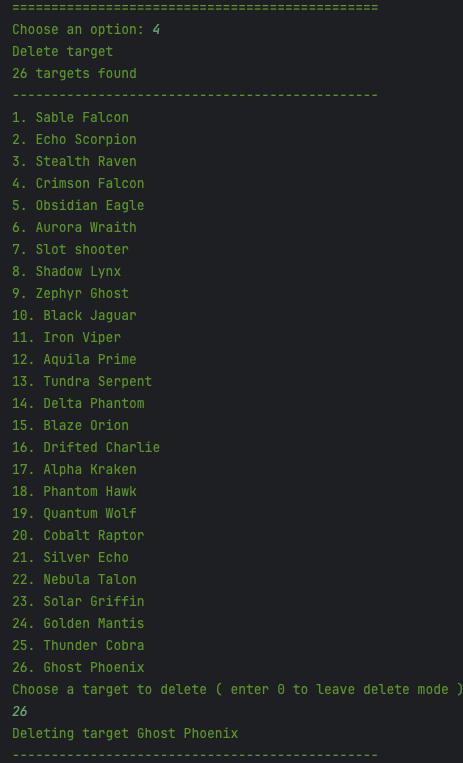

# JAVA EVAL1 SIO 2 : Récupération et historisation de données satellitaires
[]()


# Objectif

Implémenter les fonctionnalités manquantes d'une application Java permettant de récupérer des données satellitaires
depuis une API REST.

# Contexte

Vous venez d'être engagé par le Direction des renseignements intérieurs (DRI) pour travailler sur un projet frappé sous le sceau "TOP SECRET" nommé "CHREV TZYON".

Votre mission consiste à implémenter les fontionnalités permettant de collecter et historiser les données en provenance du nouveau satelitte espion de tracking d'individus.

Ce satellite est capable de traquer la position d'individu en temps réel et de la transmettre via un protocol formater comme une API REST toutes les 60 secondes vers la Terre.

## Démarrage des services
- `docker-compose up -d` pour démarrer les services
- Initialiser les données de l'api via le endpoint /init-data
## Consignes

L'idée générale est d'activer les méthodes fournies par le menu contextuel

**Résultat attendu lors de l'éxécution depuis le menu:**



### Coder les méthodes manquante dans la classe `MockChrevTzyonApiClient`
- #### Méthode `addTarget()`
    Voir la javadoc de la méthode

- #### Méthode `deleteTarget()`
    Voir la javadoc de la méthode

- #### Méthode `BuildJsonStringFromObject()`
    Voir la javadoc de la méthode

### Coder la méthode manquantes dans la classe `TrackingService` 
- #### Méthode `updateTargetsPositions()`
    Voir la javadoc de la méthode

    **Résultat attendu lors de l'éxécution depuis le menu :**

    

### Coder les méthodes manquantes dans la classe `TargetService`
- #### Méthode `getTargets()`
    Voir la javadoc de la méthode

    **Résultat attendu lors de l'éxécution depuis le menu :**

    

- #### Méthode `addTarget()`
    Voir la javadoc de la méthode

    **Résultat attendu lors de l'éxécution depuis le menu :**

    

- #### Méthode `deleteTarget()`
    Voir la javadoc de la méthode

    **Résultat attendu lors de l'éxécution depuis le menu :**

    

## Documentation

### Traitement des dates en provenance de l'API
Afin de traiter les dates, vous devez utiliser la classe `java.time.Instant` pour convertir les dates en timestamp.

```java
Instant instant = Instant.parse(lastPosition.get("Time").toString());
Timestamp timestamp = Timestamp.from(instant);
```
